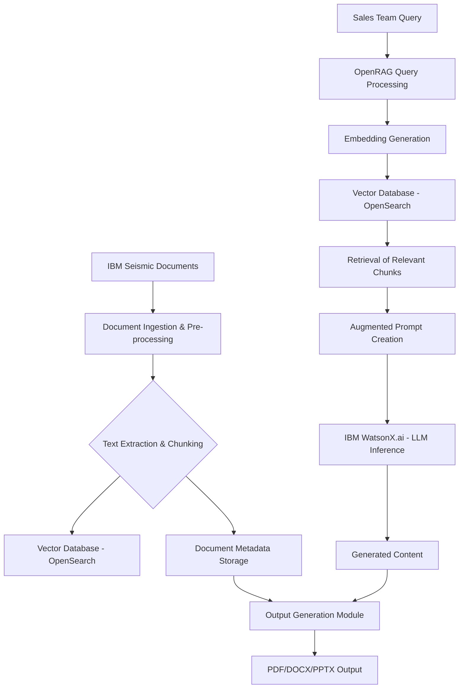

# Product Requirement Document (PRD): IBM Concert RAG System for Sales Team

## 1. Introduction

This Product Requirement Document (PRD) outlines the specifications and requirements for a Retrieval-Augmented Generation (RAG) system designed to empower the IBM sales team. The primary goal is to streamline the process of extracting critical information related to IBM Concert from documents stored in IBM Seismic, leveraging advanced AI capabilities from OpenRAG and IBM WatsonX.ai to generate accurate, context-rich responses, and deliver these in professional PDF, DOCX, or PPTX formats.

## 2. Goals and Objectives

**Goal:** To enhance the efficiency and effectiveness of the IBM sales team by providing rapid, accurate, and contextually relevant information about IBM Concert from internal documentation, presented in customizable formats.

**Objectives:**

*   **Automate Information Retrieval:** Automatically extract and process IBM Concert-related documents from IBM Seismic.
*   **Improve Response Accuracy:** Utilize RAG techniques to provide highly accurate answers to sales-specific queries, grounded in factual documentation.
*   **Accelerate Content Generation:** Significantly reduce the time and effort required to generate sales collateral (PDFs, DOCX, PPTX) based on retrieved information.
*   **Centralize Knowledge Access:** Create a unified system for accessing and leveraging IBM Concert knowledge, reducing reliance on manual searches.
*   **Enhance Sales Productivity:** Enable sales professionals to quickly access and synthesize information, leading to more informed client interactions and faster deal cycles.

## 3. Stakeholders

*   **IBM Sales Team:** Primary users who will benefit from faster access to information and automated content generation.
*   **Product Management:** Responsible for defining requirements, prioritizing features, and ensuring alignment with business goals.
*   **Engineering Team:** Responsible for the design, development, and maintenance of the RAG system.
*   **IBM Seismic Administrators:** Responsible for managing document access and permissions within Seismic.
*   **IBM WatsonX.ai Team:** Providers of the underlying AI models and platform.

## 4. User Stories

As an IBM Sales Representative, I want to:

*   **Quickly find information** about specific IBM Concert features or use cases within IBM Seismic documents, so I can answer client questions accurately during calls.
*   **Generate a customized PDF brief** on IBM Concert's integration capabilities for a client, so I don't have to manually compile information from multiple sources.
*   **Create a PPTX slide deck** summarizing the benefits of IBM Concert for a particular industry, so I can prepare for client presentations efficiently.
*   **Extract key data points** from multiple IBM Concert whitepapers, so I can build a comprehensive competitive analysis.
*   **Receive answers that are directly traceable** to source documents in IBM Seismic, so I can verify information and build trust with clients.

## 5. Functional Requirements

### 5.1. Document Ingestion and Management

*   **FR1.1:** The system shall authenticate with IBM Seismic using secure API credentials (e.g., OAuth2).
*   **FR1.2:** The system shall be able to search for IBM Concert-related documents within IBM Seismic based on user-defined criteria (e.g., keywords, document types, dates).
*   **FR1.3:** The system shall download documents from IBM Seismic in various formats (e.g., PDF, DOCX, PPTX).
*   **FR1.4:** The system shall extract text content from downloaded documents, handling different file formats robustly.
*   **FR1.5:** The system shall chunk extracted text into smaller, semantically meaningful segments.
*   **FR1.6:** The system shall store document metadata (e.g., title, author, date, source URL) alongside the extracted content.

### 5.2. Information Retrieval (OpenRAG)

*   **FR2.1:** The system shall index chunked document segments into a vector database (e.g., OpenSearch).
*   **FR2.2:** The system shall generate vector embeddings for both document chunks and user queries using a pre-trained embedding model.
*   **FR2.3:** The system shall perform semantic search against the vector database to retrieve the most relevant document segments for a given query.
*   **FR2.4:** The system shall augment user queries with retrieved document segments to provide context for the generative AI model.

### 5.3. Generative AI (IBM WatsonX.ai)

*   **FR3.1:** The system shall integrate with IBM WatsonX.ai for large language model (LLM) inference.
*   **FR3.2:** The system shall generate natural language responses to user queries based on the augmented prompt provided by OpenRAG.
*   **FR3.3:** The system shall be capable of summarizing retrieved information, answering specific questions, and drafting content sections.
*   **FR3.4:** The system shall support different foundation models within WatsonX.ai, allowing for flexibility and optimization.

### 5.4. Output Generation

*   **FR4.1:** The system shall generate output in PDF format.
*   **FR4.2:** The system shall generate output in DOCX format.
*   **FR4.3:** The system shall generate output in PPTX format.
*   **FR4.4:** The system shall apply predefined templates and styling to the generated documents for a professional appearance.
*   **FR4.5:** The system shall include citations or references to the original IBM Seismic documents in the generated output.

## 6. Non-Functional Requirements

*   **Performance:**
    *   **NFR6.1:** Query response time for information retrieval and generation shall be under 10 seconds for 90% of queries.
    *   **NFR6.2:** Document ingestion and indexing for new documents shall be completed within 24 hours.
*   **Scalability:**
    *   **NFR6.3:** The system shall be able to handle an increasing volume of documents in IBM Seismic and a growing number of concurrent users from the sales team.
*   **Security:**
    *   **NFR6.4:** All data transmission between components shall be encrypted.
    *   **NFR6.5:** Access to IBM Seismic documents and WatsonX.ai models shall adhere to IBM's security policies and access controls.
    *   **NFR6.6:** User authentication and authorization shall be robust and integrated with existing IBM identity management systems.
*   **Reliability:**
    *   **NFR6.7:** The system shall have a high availability of 99.9% during business hours.
    *   **NFR6.8:** The system shall include error handling and logging mechanisms for all critical operations.
*   **Usability:**
    *   **NFR6.9:** The user interface for submitting queries and configuring output shall be intuitive and easy to use for sales professionals.
*   **Maintainability:**
    *   **NFR6.10:** The codebase shall be well-documented and modular, allowing for easy updates and extensions.

## 7. High-Level System Architecture

## 8. Detailed Workflow

### 8.1. Document Ingestion from IBM Seismic

1.  **Authentication:** The system initiates a secure connection to IBM Seismic using pre-configured OAuth2 credentials [1].
2.  **Document Discovery:** The system periodically queries the Seismic Content Search API [2] to identify new or updated IBM Concert-related documents based on predefined criteria (e.g., document tags, creation/modification dates, keywords in titles).
3.  **Document Download:** For each identified document, the system calls the Seismic Library Content Management API [3] to download the document file. The system must handle various file types such as PDF, DOCX, and potentially PPTX.
4.  **Text Extraction:** Depending on the document type:
    *   **PDF:** Utilize Python libraries (e.g., `pypdf`, `pdfminer.six`) to extract text content.
    *   **DOCX:** Utilize Python libraries (e.g., `python-docx`) to extract text content.
    *   **PPTX:** If required, utilize Python libraries (e.g., `python-pptx`) to extract text from slides.
5.  **Text Chunking:** The extracted raw text is divided into smaller, overlapping chunks to optimize for embedding and retrieval. Chunk size and overlap will be configurable parameters.
6.  **Embedding Generation:** Each text chunk is converted into a high-dimensional vector embedding using an embedding model available through IBM WatsonX.ai or a compatible model within OpenRAG.
7.  **Indexing:** The text chunks and their corresponding embeddings, along with relevant metadata (e.g., document ID, title, source URL, page number), are stored in a vector database (e.g., OpenSearch) for efficient semantic search.

### 8.2. Information Retrieval and Generation

1.  **User Query:** An IBM sales team member submits a natural language query through a user interface (to be developed separately).
2.  **Query Embedding:** OpenRAG converts the user's query into a vector embedding using the same embedding model used for document chunks.
3.  **Semantic Search:** OpenRAG performs a similarity search in the vector database to identify the top-k most relevant document chunks based on their embeddings.
4.  **Context Augmentation:** The retrieved document chunks are combined with the original user query to create an augmented prompt. This prompt provides the necessary context for the LLM to generate an informed response.
5.  **LLM Inference:** The augmented prompt is sent to a selected foundation model within IBM WatsonX.ai. The LLM processes the prompt and generates a coherent and contextually relevant answer.
6.  **Response Refinement (Optional):** If specific data extraction or summarization is needed, WatsonX.ai's text extraction capabilities [5] can be applied to the generated content or retrieved chunks before final output.

### 8.3. Output Formatting and Delivery

1.  **Content Assembly:** The generated text from WatsonX.ai is assembled, potentially incorporating additional metadata or structural elements.
2.  **Document Generation:** Based on the user's selected output format (PDF, DOCX, or PPTX):
    *   **PDF:** Python libraries like `ReportLab` or `fpdf2` will be used to create a PDF document, applying predefined templates, styling, and including references.
    *   **DOCX:** Python libraries like `python-docx` will be used to create a Word document, applying corporate templates, formatting, and inserting generated text and references.
    *   **PPTX:** Python libraries like `python-pptx` will be used to create a PowerPoint presentation, populating slides with generated content, bullet points, and relevant visuals (if specified).
3.  **Citation Inclusion:** Each generated document will include inline citations and a 
References section linking back to the original Seismic documents.
4.  **Delivery:** The final document is made available to the sales team member, potentially through a download link or integration with a sales enablement platform.

## 9. Future Enhancements

*   **Multi-modal Content Support:** Extend the system to process and generate content from images, videos, and audio within IBM Seismic documents.
*   **Proactive Content Generation:** Develop capabilities to proactively generate sales collateral based on upcoming client meetings or market trends.
*   **Feedback Loop:** Implement a feedback mechanism for sales users to rate the quality and relevance of generated content, continuously improving the system.
*   **Integration with CRM:** Integrate with CRM systems (e.g., Salesforce) to automatically push generated content or insights to relevant client records.

## 10. References

[1] Seismic API Documentation - Authentication Overview: [https://developer.seismic.com/seismicsoftware/reference/introduction-overview](https://developer.seismic.com/seismicsoftware/reference/introduction-overview)
[2] Seismic API Documentation - Content Search: [https://developer.seismic.com/seismicsoftware/reference/contentsearch](https://developer.seismic.com/seismicsoftware/reference/contentsearch)
[3] Seismic API Documentation - Download a file: [https://developer.seismic.com/seismicsoftware/reference/seismiclibrarycontentmanagementdownloadafile](https://developer.seismic.com/seismicsoftware/reference/seismiclibrarycontentmanagementdownloadafile)
[4] “OpenRAG” From Documents to Agentic Search in Minutes (from IBM research open source): [https://alain-airom.medium.com/openrag-from-documents-to-agentic-search-in-minutes-from-ibm-research-open-source-ed6bf506507b](https://alain-airom.medium.com/openrag-from-documents-to-agentic-search-in-minutes-from-ibm-research-open-source-ed6bf506507b)
[5] Text extraction — Docs | IBM watsonx: [https://dataplatform.cloud.ibm.com/docs/content/wsj/analyze-data/fm-api-text-extraction.html?context=wx](https://dataplatform.cloud.ibm.com/docs/content/wsj/analyze-data/fm-api-text-extraction.html?context=wx)
